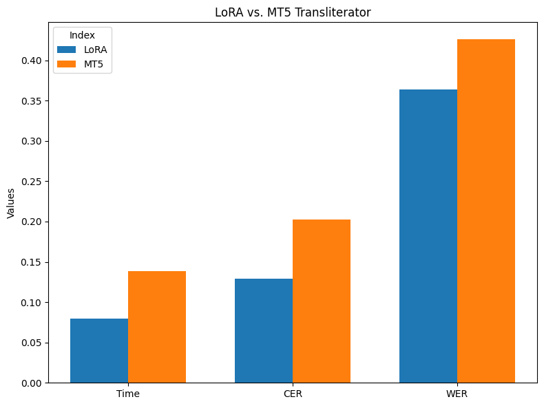

# English-to-Korean Transliterator | 영한 음역기

본 프로젝트는 영단어를 한국어 발음으로 나타내는 transliteration (음역) task를 지원합니다.

- 주요 특징
    1. 기존 [MT5 기반 음역기](https://github.com/eunsour/engtokor-transliterator/tree/main)의 과도한 용량 (~1.2GB)과 느린 추론 속도를 개선합니다.
        - 약 300MB의 경량화된 모델 사이즈와 더 나은 속도, 정확도의 영단어 음역 결과를 제공합니다. (아래 성능 비교 참고)
    2. 구조적으로는 MarianMT 번역 모델에 LoRA를 적용했습니다.
        - 해당 fine-tuned 모델은 [HuggingFace](https://huggingface.co/feVeRin/enko-transliteration)에서 다운로드할 수 있습니다.

- 성능 비교
    

## How to Start

1. Install dependencies (PyTorch는 기본적으로 설치되어 있다고 가정합니다):

    ```bash
    pip install -r requirements.txt
    ```

2. Clone Repository:

    ```bash
    git clone https://github.com/feVeRin/enko_transliterator.git
    ```

## How to Use

- 기본적으로 영단어를 해당하는 발음으로 음역합니다. (e.g. `english` -> `잉글리시`)
    1. 영단어 음역 (Pre-trained model 사용)

        ```python
        from transliteration import Transliterator

        model = Transliterator.from_pretrained('feVeRin/enko-transliteration')
        result = model.transliterate('LORA IS ALL YOU NEED')
        print(result)  # 로라 이즈 올 유 니드
        ```

    2. 모델 학습 (From scratch)
        - wandb 계정이 필요할 수 있습니다

        ```python
        from train import LoRATrainer
        from data.textdataset import TextDataset

        trainer = LoRATrainer()
        trainer.set_lora(r=16, alpha=32, dropout=0.1)
        train_dataset, val_dataset = trainer.data_split('./data/data.txt', 0.2)
        trainer.train(train_dataset, val_dataset)
        ```

## References

- 본 프로젝트는 engtokor-transliterator에서 제공하는 [데이터셋](https://github.com/eunsour/engtokor-transliterator/tree/main)을 사용했습니다.
- LoRA 적용을 위한 [Base 모델](Neurora/opus-hplt-en-ko-v2.0)은 opus-hplt-en-ko 모델을 사용했습니다.
