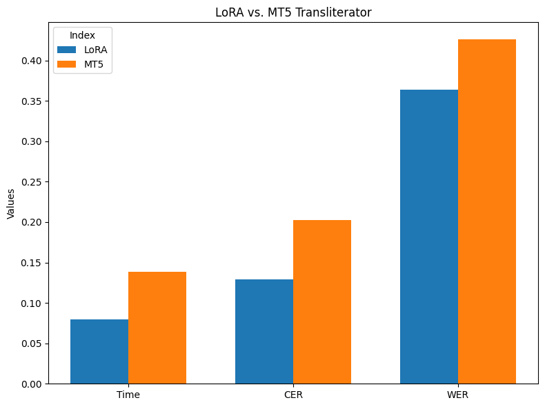

# English-to-Korean Transliterator | 영한 음역기

▶ README: [ENGLISH](../README.md) | [**한국어**](README.ko.md)

본 프로젝트는 영단어를 한국어 발음으로 나타내는 transliteration (음역) 작업을 지원합니다 (e.g. `english` -> `잉글리시`). 특히 기존 [MT5 기반 음역기](https://github.com/eunsour/engtokor-transliterator/tree/main)의 과도한 용량 (~1.2GB)과 느린 추론 속도를 개선합니다.

- **주요 특징**
    1. 약 400MB의 경량화된 모델 사이즈로 더 나은 속도, 정확도의 영단어 음역 결과를 제공합니다.
        - 아래 성능 비교 참고
    2. 구조적으로는 MarianMT 번역 모델에 LoRA를 적용했습니다.
        - 해당 fine-tuned 모델은 [HuggingFace](https://huggingface.co/feVeRin/enko-transliteration)를 통해 제공됩니다.

- **성능 비교**  

    

## How to Start

1. Install dependencies (PyTorch는 기본적으로 설치되어 있다고 가정합니다):

    ```bash
    pip install -r requirements.txt
    ```

2. Clone Repository:

    ```bash
    git clone https://github.com/feVeRin/enko_transliterator.git
    ```

## How to Use

1. 영단어 음역 (Pre-trained model 사용)

    ```python
    from transliteration import Transliterator

    model = Transliterator.from_pretrained('feVeRin/enko-transliteration')
    result = model.transliterate('LORA IS ALL YOU NEED')
    print(result)  # 로라 이즈 올 유 니드
    ```

2. 모델 학습 (From scratch)
    - Training 시 wandb와 연동됩니다. 불필요하다면 `train()` 함수에 `report_to=None`을 추가하세요.

    ```python
    from train import LoRATrainer
    from data.textdataset import TextDataset

    trainer = LoRATrainer()
    trainer.set_lora(r=16, alpha=32, dropout=0.1)
    train_dataset, val_dataset = trainer.data_split('./data/data.txt', 0.2)
    trainer.train(train_dataset, val_dataset)
    ```

## References

- 본 프로젝트는 EngtoKor-Transliterator에서 제공하는 [데이터셋](https://github.com/eunsour/engtokor-transliterator/tree/main)을 사용했습니다.
- LoRA 적용을 위한 base 모델은 [Opus-hplt-EN-KO](https://huggingface.co/Neurora/opus-hplt-en-ko-v2.0)를 사용했습니다.
